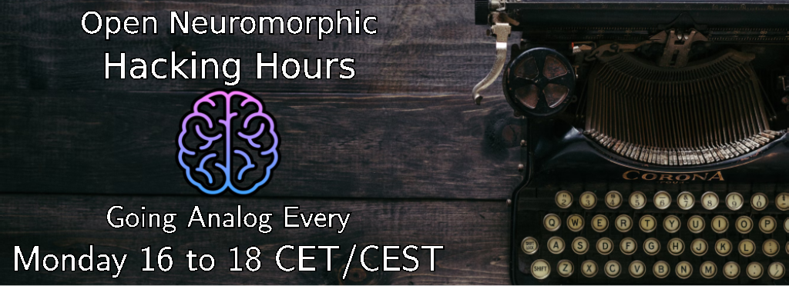

Are you interested in neuromorphics and want to contribute to the open source community? ✨ Then join the community coding sessions where we improve the neuromorphic software ecosystem, one issue at the time 🚀

We'll meet **every Monday from 16-18 CET** on the [Open Neuromorphic Discord server](https://discord.gg/aPFsSRA7Nf).

The goal is to meet up, hack on projects, close issues, and have fun!

## 🚀 Completed pull requests and issues 🚀
The entire point is to move things forward and get stuff done---and it's working! The below issues and pull requests were all closed during the hacking hours:

* [AEStream](https://github.com/aestream/aestream): [#96](https://github.com/aestream/aestream/pull/96), [#98](https://github.com/aestream/aestream/pull/98), [#100](https://github.com/aestream/aestream/pull/100), [#108](https://github.com/aestream/aestream/pull/108), [#110](https://github.com/aestream/aestream/pull/110), [#111](https://github.com/aestream/aestream/pull/111)
* [NIR](https://github.com/neuromorphs/nir/): [#76](https://github.com/neuromorphs/nir/pull/76), [#104](https://github.com/neuromorphs/nir/pull/104)
* [Open-Neuromorphic.github.io](https://github.com/open-neuromorphic/open-neuromorphic.github.io): [#169](https://github.com/open-neuromorphic/open-neuromorphic.github.io/pull/169)

## Projects with open issues that needs help
Want to help out? Pick a project you care about and start hacking 👇

<!-- NOTE TO CONTRIBUTORS
Every hour, a script will search for two HTML comment tags with the org/repo name.
Everything between the tags WILL BE REPLACED with issues that are open AND have the talk "help wanted".
If you want to add your own project, simply add three lines:
1. The header with the project title,
2. The starting HTML comment, and
3. The ending HTML comment
-->

### [AEStream](https://github.com/aestream/aestream) - Seamless plug'n'play streaming for event data 
<!-- aestream/aestream -->
* [Test AEStream on Windows](https://github.com/aestream/aestream/issues/94)
* [Benchmark and use C-API for Inivation cameras](https://github.com/aestream/aestream/issues/93)
* [Implement ONM benchmark for EVT files](https://github.com/aestream/aestream/issues/92)
* [Introduce modular install of event cameras](https://github.com/aestream/aestream/issues/54)
* [Build Docker containers](https://github.com/aestream/aestream/issues/53)
<!-- aestream/aestream -->

### [Neuromorphic Intermediate Representation (NIR)](https://github.com/neuromorphs/nir) - A neuromorphic continuous-time instruction set
<!-- neuromorphs/nir -->
* [Upload example code in the documentation `docs/source/examples`](https://github.com/neuromorphs/NIR/issues/26)
<!-- neuromorphs/nir -->

### [Norse](https://github.com/norse/norse) - A functional spiking neural network simulator for deep learning
<!-- norse/norse -->
* [Speech commands loading broken](https://github.com/norse/norse/issues/383)
* [Improve docs](https://github.com/norse/norse/issues/374)
* [ipywidgets package missing when executing notebook for documentation](https://github.com/norse/norse/issues/373)
* [Require an example that using STDP to train the SNN](https://github.com/norse/norse/issues/366)
<!-- norse/norse -->

### [Spyx](https://github.com/kmheckel/spyx) - SNNs in JAX
<!-- kmheckel/spyx -->
* [Add shape checking to Accuracy and Loss functions](https://github.com/kmheckel/spyx/issues/25)
* [Support for latency-based spike coding](https://github.com/kmheckel/spyx/issues/21)
* [Add Spiking-RWKV layer to support SpikeGPT architectures](https://github.com/kmheckel/spyx/issues/9)
* [Write test cases for CI/CD](https://github.com/kmheckel/spyx/issues/6)
<!-- kmheckel/spyx -->

## How to contribute
Join the chat, update this README file with your project, or just reach out on our Discord.

## Acknowledgements
Community coding projects is organized by [Jens E. Pedersen](https://github.com/jegp) and hosted by the [Open Neuromorphic organization](https://github.com/open-neuromorphic).
